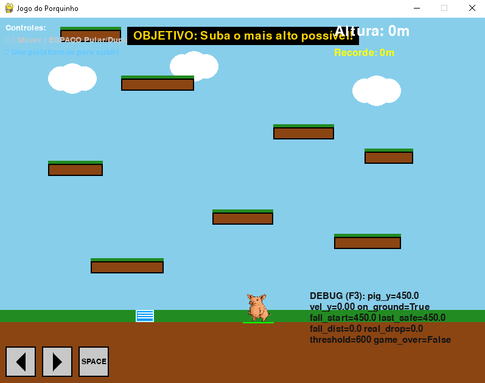

# 🐷 Jogo do Porquinho

Arcade vertical infinito em Python (Pygame): guie o porquinho saltador por plataformas geradas proceduralmente, use molas, evite quedas fatais e alcance a maior altitude.



## 📝 Descrição

Você controla um porquinho rosa em um desafio de ascensão infinita: pule de plataforma em plataforma (algumas quebram, outras têm molas), use pulo duplo e administre o risco de quedas longas. Se tocar o chão após ter realmente subido (pisado em uma plataforma), o layout se regenera totalmente. Quedas acima de 60m resultam em Game Over.

## 🎮 Como Jogar

### Controles
- **← / →**: Mover
- **ESPAÇO**: Pular / Pulo duplo
- **F3**: Mostrar/ocultar overlay de debug
- **ESPAÇO (Game Over)**: Reiniciar
- **Fechar janela (X)**: Sair

### Objetivo
Suba o máximo possível gerindo pulos, molas e timing. Evite queda fatal (> 60m) e aproveite cada novo layout.

## 🛠️ Especificações Técnicas

### Requisitos do Sistema
- **Python**: 3.6 ou superior
- **Pygame**: 2.0 ou superior
- **Sistema Operacional**: Windows, macOS, ou Linux

### Configurações do Jogo
- **Resolução**: 800x600 pixels
- **Taxa de Quadros**: 60 FPS
- **Estilo Gráfico**: 2D com formas geométricas simples

### Principais Sistemas

#### Personagem
- Sprite 50x50 (espelhado conforme direção)
- Pulo normal (-15), pulo duplo (-12), super pulo de mola (-30)

#### Plataformas
- Geração procedural infinita (mantém buffer acima)
- Tipos: normal, quebrável (uso único), com mola
- Regeneração total só ao cair no chão após ter subido
- Chance de mola no chão em alguns ciclos

#### Quedas
- Limiar seguro: 60m (1m = 10px)
- Game Over se queda > 60m e queda real desde último pouso seguro > 60m

#### Partículas / Feedback
- Efeitos: pulo (cinza), duplo (amarelo), mola (azul), quebra (fragmentos), crash (vermelho)
- Overlay debug (F3) com métricas de queda e velocidade

#### HUD & UI
- Altura atual + recorde + barra de progresso
- Indicadores de pulo duplo
- Botões virtuais na tela (setas e espaço)

#### Paleta
- Azul Céu: (135,206,235)
- Verde Grama: (34,139,34)
- Marrom Terra: (139,69,19)
- Branco: (255,255,255)
- Rosa: (255,182,193)

## 🚀 Como Executar

### 1. Instalação das Dependências
```bash
pip install pygame
```

### 2. Executar o Jogo
```bash
python game.py
```

### 3. Instalação Alternativa (Windows)
Se você estiver usando Windows com Python instalado via Microsoft Store:
```powershell
python3.11 -m pip install pygame
python3.11 game.py
```

## 📁 Estrutura do Projeto

```
gamePig/
├── game.py          # Código principal
├── pig.png          # Sprite do personagem
├── smoke.png        # (Opcional) sprite de partículas
├── teladogame.png   # Screenshot
└── README.md
```

## 🔧 Funcionalidades Implementadas

- ✅ Movimento lateral + limites
- ✅ Pulo + pulo duplo
- ✅ Super pulo (molas)
- ✅ Plataformas quebráveis
- ✅ Geração procedural infinita
- ✅ Regeneração de layout ao retornar ao chão (após progresso)
- ✅ Câmera suave
- ✅ Sistema de altura + recorde
- ✅ Queda fatal (60m) com lógica segura
- ✅ Partículas variadas (pulo, duplo, mola, quebra, crash)
- ✅ Overlay debug (F3)
- ✅ Botões virtuais de controle
- ✅ Sprite espelhado automático
- ✅ Mola aleatória no chão

## 🎯 Melhorias Futuras (Ideias)

- Parallax scrolling
- Efeitos sonoros e música
- Itens coletáveis / moedas
- Inimigos e hazards
- Plataformas móveis, gelo, deslizantes
- Persistência de recordes
- Conquistas / desafios diários
- Power-ups extras (escudo de queda, pulo triplo temporário)
- Modo mobile (toque)

## 🐛 Problemas Conhecidos

- Balanceamento de chance de molas simples
- Sem áudio ainda
- Recorde não persiste entre execuções

## 👨‍💻 Desenvolvimento

### Blocos Principais
- Loop principal: input → física → geração → colisões → câmera → render
- Geração: mantém buffer de plataformas acima e remove antigas
- Queda: rastreia pico (fall_start_height) e último pouso seguro (last_safe_y)
- Partículas: lista com atualização/frame e fade
- Regeneração: só dispara após progresso real

### Dependências
- pygame
- sys
- random

## 📜 Licença

Este é um projeto educacional e está disponível para uso livre.

## 🤝 Contribuições

Sinta-se à vontade para fazer fork do projeto e implementar melhorias!

---

**Desenvolvido com ❤️ usando Python e Pygame**
